# 6-DOF Reusable Rocket Simulator & Autonomous Landing GNC

A full-stack, six-degree-of-freedom flight dynamics and GNC (guidance–navigation–control) research platform for a propulsively-landing reusable launch vehicle — written for, and evaluated under, the same kind of Monte Carlo discipline used in real launch-vehicle programs. Python + NumPy/SciPy, 68 tests, ~6.3 kLOC of simulation core, no black boxes.

```text
                 ┌──────────────────────────────┐
                 │           Vehicle            │
                 │  6-DOF rigid body + slosh-   │
                 │  free prop, staging, gimbal  │
                 └──────────────┬───────────────┘
                                ▼
        ┌────────────┐  Environment (US-76 atm, wind, g(r))
        │  Sensors   │  IMU · GPS(latency/outage) · baro · radar alt
        └─────┬──────┘
              ▼
        ┌────────────┐  Navigation
        │    EKF     │  15-state error-state MEKF (or USQUE-style UKF)
        └─────┬──────┘
              ▼
        ┌────────────┐  Guidance
        │  ZEM/ZEV · │  gravity turn · poly · fuel-optimal SLSQP NLP
        │  poly/opt. │
        └─────┬──────┘
              ▼
        ┌────────────┐  Control              ┌────────────┐
        │ PID · LQR  │──► Actuators ─────────│  gimbal    │
        │ geom · MPC │   2nd-order servo,    │  throttle  │
        └────────────┘   lag+delay, RCS      └────────────┘
```

**Headline results** — two-stage ascent to 371 km with staging at t+160 s; closed-loop propulsive landing through wind, sensor noise and a 10 s GPS outage touching down at 1.7 m/s vertical, 1.0° tilt, 2.0 m off-target; a **100,000-run vectorized Monte Carlo** (≈32 ms/run) under 10 dispersion axes; a calibrated ML landing-success predictor; and a CEM policy-search study against the classical baseline.

---

## Table of contents

1. [Frames, conventions, state](#1-frames-conventions-state)
2. [Equations of motion](#2-equations-of-motion)
3. [Environment](#3-environment)
4. [Vehicle model](#4-vehicle-model)
5. [Sensors](#5-sensors)
6. [Navigation — error-state EKF / UKF](#6-navigation)
7. [Guidance](#7-guidance)
8. [Control](#8-control)
9. [Simulation loop](#9-simulation-loop)
10. [Monte Carlo methodology](#10-monte-carlo-methodology)
11. [Results](#11-results)
12. [ML landing-success predictor](#12-ml-landing-success-predictor)
13. [Policy search vs classical baseline](#13-policy-search-vs-classical-baseline)
14. [Limitations & honesty notes](#14-limitations--honesty-notes)
15. [Repository layout & reproduction](#15-repository-layout--reproduction)
16. [References](#16-references)

---

## 1. Frames, conventions, state

**Inertial frame $\mathcal{I}$** — local flat-Earth ENU fixed at the landing pad: $\hat{x}$ East, $\hat{y}$ North, $\hat{z}$ Up. Earth rotation (Coriolis/centrifugal terms) is neglected; flight durations are $< 600$ s and ranges $< 1{,}500$ km, so the error enters only through the $g(r)$ model, which we do keep altitude-dependent.

**Body frame $\mathcal{B}$** — $x_B$ is the longitudinal axis pointing engine→nose (the thrust axis), $y_B, z_B$ lateral. Engine base sits at $x_B=0$, nose at $x_B=L$.

**Attitude** — scalar-first Hamilton quaternion $q=[q_0,\mathbf{q}_v]$, body→inertial, with

$$\mathbf{v}_I = R(q)\,\mathbf{v}_B,\qquad \dot{q} = \tfrac{1}{2}\,q\otimes\begin{bmatrix}0\\ \boldsymbol{\omega}_B\end{bmatrix}$$

**State** — $x = [\,\mathbf{r}_I\; \mathbf{v}_I\; q\; \boldsymbol{\omega}_B\; m\,] \in \mathbb{R}^{14}$. Position/velocity in $\mathcal{I}$, body rates in $\mathcal{B}$, total mass.

## 2. Equations of motion

Rigid-body dynamics about the (moving) center of mass:

$$\dot{\mathbf{r}}_I = \mathbf{v}_I,\qquad
\dot{\mathbf{v}}_I = \frac{1}{m}R(q)\mathbf{F}_B + \mathbf{g}(\mathbf{r}_I)$$

$$J\dot{\boldsymbol{\omega}}_B = \mathbf{M}_B - \boldsymbol{\omega}_B\times J\boldsymbol{\omega}_B,\qquad
\dot{m} = -\dot{m}_e$$

The $\dot{J}\boldsymbol{\omega}$ term is neglected ($J$ varies slowly through the burn); angular momentum error from this over a 30 s landing burn is below the integration tolerance.

**Thrust.** A gimbaled engine produces thrust along the deflected nozzle axis

$$\hat{\mathbf{t}}_B = \begin{bmatrix}\cos\delta_y\cos\delta_z\\ \sin\delta_z\\ -\sin\delta_y\cos\delta_z\end{bmatrix},\qquad
\mathbf{T}_B = T\,\hat{\mathbf{t}}_B,\qquad
T = \bar{T}\,\eta - p_{\text{amb}}A_e n_e$$

with $\bar{T}$ the commanded vacuum thrust ($\eta\in[0.35,1]$ throttle, $0$ = off), $p_{\text{amb}}A_e n_e$ the back-pressure loss, and moment about the CG

$$\mathbf{M}_{\text{tvc}} = (\mathbf{r}_{\text{gim}}-\mathbf{r}_{\text{cg}})\times\mathbf{T}_B$$

With the gimbal point *below* the CG, $+\delta_z$ slews thrust toward $+y_B$ and produces a moment about $-z_B$ — the classic "steer the exhaust opposite the desired rotation" TVC geometry. (Getting this sign wrong produces exponentially divergent attitude; the test suite pins it down against the nonlinear dynamics.)

**Mass flow** $\dot{m}_e = \bar{T}/(I_{sp}^{\text{vac}}g_0)$; sea-level thrust loss is modeled but mass flow follows vacuum conditions (consistent with how engine specs are quoted).

**Integration.** Fixed-step RK4 at $\Delta t=10$ ms (control ZOH at 50 Hz) with post-step quaternion renormalization; an adaptive RK45 path (`solve_ivp`, $rtol=10^{-8}$) is used for verification. A 30 s vacuum ballistic arc conserves specific mechanical energy to $10^{-6}$ relative — this is the regression test that would catch a force-sign or frame error.

## 3. Environment

**Atmosphere** — full 7-layer U.S. Standard Atmosphere 1976 (geopotential altitude, $0$–$86$ km; exponential density tail with $H=7$ km above):

$$T = T_b + L_b(h-h_b),\qquad
p = \begin{cases} p_b\left(\dfrac{T}{T_b}\right)^{\!-g_0/(L_bR)} & L_b\neq 0\\[2mm] p_b\,e^{-g_0(h-h_b)/(RT_b)} & L_b=0\end{cases}$$

$$\rho=\frac{p}{RT},\qquad a=\sqrt{\gamma RT}$$

Validated against the standard tables (22632 Pa @ 11 km, 5474.9 Pa @ 20 km, 868.0 Pa @ 32 km, …, all < 1%). Fully vectorized over altitude — the same callable serves the scalar sim and the 100k-run batch engine. A multiplicative `density_scale` dispersion is applied consistently to $p$ *and* $\rho$ so $p=\rho RT$ is preserved.

**Gravity** — inverse-square along the local vertical: $\mathbf{g} = -\mu\hat{z}/(R_\oplus+z)^2$.

**Wind** — steady field with power-law shear $w(z)=w_{10}(z/10)^{0.14}$ capped at 300 m, plus a first-order Gauss–Markov (Dryden-style) gust per axis, $\dot{u}_g = -u_g/\tau + \sigma_g\sqrt{2/\tau}\,\mathcal{N}(0,1)/\sqrt{dt}$, $\tau=L_g/V$.

## 4. Vehicle model

Each stage: dry cylinder + propellant cylinder whose fill height (and hence CG) shrinks toward the base as it depletes; inertia via the cylinder tensor + parallel-axis about the instantaneous CG:

$$J_x=\tfrac12mr^2,\qquad J_{y,z}=m\,\tfrac{3r^2+h^2}{12}+m\,\Delta x^2$$

Both mass depletion *and* CG/inertia migration feed the dynamics — the landing vehicle's transverse inertia swings by $\sim$2× over the burn, which the controllers must absorb (LQR gain-schedules on it).

**Landing vehicle** (Falcon-9-class booster, approximate public figures): dry 27 t + 10 t prop at entry, $T_{\max}$ = 845 kN vac, $I_{sp}$ 311/282 s, gimbal ±8° at 20°/s, $L=41$ m, $\varnothing\,3.7$ m. Critically, the **throttle floor of 0.35 gives minimum-thrust acceleration ≈ 8.1 m/s² < g** — the vehicle cannot hover. This is the real hover-slam problem: terminal velocity must cross zero exactly when altitude does.

**Ascent vehicle**: two stages (stage 1: 9 engines, 400 t prop; stage 2: 1 engine, 934 kN vac, 90 t prop) + 10 t payload, hot-staging-style separation with a 2 s coast.

**Aerodynamics** — axial drag $C_D(M)$ from a Mach table (0.30 subsonic → 0.60 transonic peak @ $M{=}1.1$ → 0.25 @ $M{=}5$), normal force $C_{N_\alpha}\sin\alpha\,q_\infty S$ acting at the (aerodynamically-stable, grid-fin-biased) center of pressure, plus pitch/yaw/roll damping moments nondimensionalized by $L/(2V)$.

## 5. Sensors

| Sensor | Rate | Model |
|---|---|---|
| IMU | 200 Hz | $f_B = R(q)^\top(a_I - g_I) + b_a + s_a\odot f + \text{misalign} + n$; $\omega$ likewise. Constant bias + Gauss–Markov bias walk + $\sqrt{\text{rate}}$-scaled white noise + 300 ppm scale factor + 0.5 mrad misalignment. Tactical-grade defaults (1 mg, 0.005°/√s). |
| GPS | 10 Hz | pos $\sigma$ (1.5, 1.5, 3) m, vel 0.1 m/s; **FIFO transport delay** (default 0.1 s, `t_valid` tag), random dropouts, scripted **outage windows**, 3× multipath growth below 50 m |
| Barometer | 50 Hz | US76 pressure + 10 Pa white + 20 Pa GM bias; inverted back through the layer model; $\sigma_h = \sigma_p/(\rho g)$ propagated |
| Radar altimeter | 25 Hz | slant range $z/\cos\theta$ to the ground plane, valid $\le 2$ km & tilt < 30°, 0.1 m + 0.5% noise |

## 6. Navigation

**Multiplicative EKF (MEKF)** on the 15-dim error state $\delta x = [\delta\mathbf{r},\ \delta\mathbf{v},\ \delta\boldsymbol{\theta},\ \delta\mathbf{b}_a,\ \delta\mathbf{b}_g]$:

$$F=\begin{bmatrix} 0 & I & 0 & 0 & 0\\ 0 & 0 & -R(\hat q)[\hat{\mathbf{f}}]_\times & -R(\hat q) & 0\\ 0 & 0 & -[\hat{\boldsymbol{\omega}}]_\times & 0 & -I\\ 0&0&0&0&0\\ 0&0&0&0&0\end{bmatrix},
\qquad \Phi_k \approx I + F\Delta t + \tfrac12 F^2\Delta t^2$$

Strapdown mechanization $\hat q \leftarrow \hat q\otimes\exp(\tfrac12(\omega_m-\hat b_g)\Delta t)$; process noise $Q = GQ_cG^\top\Delta t$ from IMU densities. Updates: GPS pos/vel, baro altitude, radar slant range (attitude-coupled Jacobian by central differences). Joseph-form covariance update, $\chi^2$ 99% innovation gating, error injection $\hat q\leftarrow \hat q\otimes[1,\ \tfrac12\delta\boldsymbol{\theta}]$ + reset. **Delayed GPS** is handled by keeping a nominal-state history and forming the innovation at `t_valid` while correcting the current state — the standard current-state-correction approximation.

**UKF** — USQUE-style: sigma points on the error vector, attitude sigma points injected via $\exp(\delta\theta)$, mean recovered through a 2-pass rotation-vector mean. Same mechanization/measurement functions as the EKF.

**Performance** on a 30 s powered approach (test-pinned): EKF final errors < 3 m / 0.3 m/s / 0.5°; survives a 10 s terminal GPS outage by dead-reckoning with baro aiding (< 30 m growth); per-type mean NIS ∈ [0.3, 3] × dof.

## 7. Guidance

### 7.1 Ascent

Vertical to 500 m → 4° pitch kick (5 s) → **gravity turn** (zero-$\alpha$ steering, thrust ∥ $\hat v$) to MECO → stage separation + coast → second-stage **linear-tangent steering** toward a 200 km apogee target. Achieved: staging at $t{=}159.8$ s, $q_{\max}$ = 33.3 kPa at 76.7 s, apogee ≈ 376 km, 1397 km downrange at sim cutoff.

### 7.2 Powered descent — trajectory shaping

**ZEM/ZEV.** For point-mass $\ddot r = u + g$, defining

$$\text{ZEM} = r_f - r - vt_{go} - \tfrac12 g t_{go}^2,\qquad
\text{ZEV} = v_f - v - gt_{go}$$

the quadratic-optimal acceleration command is

$$u = \frac{6\,\text{ZEM}}{t_{go}^2} - \frac{2\,\text{ZEV}}{t_{go}}$$

with the kinematic time-to-go $t_{go} = -2(z-z_f)/(v_z+v_{fz})$ (self-consistent under continuous replanning — it counts down with the descent rather than chasing a feasibility boundary). A brake-margin factor $t_{go}\times1.15$ schedules slightly early braking so actuator/attitude lag doesn't arrive hot. Lateral channels use a bounded-approach-speed servo $v_{\text{des}} = \text{clip}((r_f-r)/\tau_{\text{app}}, \pm25)\cdot\min(z/100,1)$, $a_{\text{lat}} = 0.45(v_{\text{des}}-v)$, low-pass filtered at $\tau{=}1.5$ s. Commanded acceleration is shaped by an altitude-tapered **tilt cone** $|a_{\text{lat}}| \le a_z\tan\theta_{\text{cap}}$ (35° → 3° below 150 m) and clamped to $0.95\,T_{\max}/m$.

**Polynomial (Apollo/E-guidance).** $u(\tau)=c_0{+}c_1\tau$ fit per axis through $(r,v)\to(r_f,v_f)$ boundary conditions; the quadratic extension additionally pins $u(T)=a_f$. (Implementation note surfaced by closed-loop testing: the quadratic-pinned form leaves $u(0)$ under-determined under replanning and degenerates — the linear form, which is exactly ZEM/ZEV-equivalent at $\tau{=}0$, is what flies.)

**Ignition logic.** Engine stays off until the 1-DOF hover-slam estimate says start:

$$h_{\text{ignite}} = \frac{v_z^2}{2\cdot 0.85\,(T_{\max}/m - g)} + 150\ \text{m}$$

Before ignition the vehicle coasts base-first under RCS-only attitude control (aerodynamically stabilized by the aft CP), holding a retrograde/vertical blend attitude.

### 7.3 Fuel-optimal powered descent — receding-horizon NLP

A 3-DOF point-mass direct multiple-shooting problem, solved by SLSQP every 1.5 s, warm-started from the shifted previous plan. Decision vector $z=[u_0\ldots u_{N-1}, t_f]$, $N{=}20$ nodes, forward-Euler rollout with exact rocket-equation mass decay $m_{k+1} = m_k e^{-|u_k|\Delta t/(I_{sp}g_0)}$ (floored at dry mass):

$$\min_z\ \sum_{k}|u_k|\Delta t\quad\text{s.t.}\quad
r(t_f)=r_f,\ v(t_f)=v_f,\quad
\frac{T_{\min}}{m_k}\le|u_k|\le\frac{T_{\max}}{m_k},$$

$$\sqrt{x_k^2+y_k^2}\le z_k\tan 75°\ \ (\text{glide slope}),\qquad
u_{k,z}\ge|u_k|\cos\theta(z_k),\ \theta=\begin{cases}20°&z\ge50\,\text{m}\\8°&z<50\,\text{m}\end{cases}$$

All constraint Jacobians are **analytic** via forward sensitivity propagation $P_{k+1}=A_kP_k+B_k\partial/\partial u_k + b_k\partial/\partial t_f$ — no finite differences. If SLSQP fails or violates tolerance, the ZEM/ZEV command is issued instead (`fallback_count` is logged). Between replans, $u(t)$ is interpolated from the plan plus a PD correction toward the planned trajectory.

## 8. Control

All controllers share thrust/attitude allocation: $T=\text{clip}(m|a_{cmd}|,T_{\min},T_{\max})$, desired body $x$-axis ∥ $\hat a_{cmd}$, minimal-rotation $q_{des}$ (roll free — single gimbal has no roll authority; roll is damped aerodynamically + RCS). During coast the RCS (max 40 kN·m pitch/yaw, 5 kN·m roll, 20 ms lag) runs a pure PD attitude hold.

| Controller | Law | Notes |
|---|---|---|
| **PID** | cascaded attitude-error → rate → moment, gains normalized by authority $T\ell/J$ | the honest baseline |
| **LQR** | per lateral axis on $[y,\dot y,\theta,\omega,\delta]$ with plant $\ddot y = (T/m)\theta - (T/m)\delta$, $\ddot\theta = (T\ell/J)\delta$, gimbal lag $\dot\delta=(\delta_c-\delta)/\tau$; CARE gains re-scheduled when $T$ or $m$ move > 5% | tracks $(r_{ref}, v_{ref}, \theta_{ff})$ feedforward |
| **Geometric** | $M_{des} = -K_R e_R - K_\omega\omega + \omega\times J\omega$ on SO(3), exact gimbal inverse $\delta=\sin^{-1}(M/T\ell)$ with anti-saturation tilt scaling | $K_R{=}4J$, $K_\omega{=}2.5J$ |
| **MPC** | per-axis condensed QP over the same 5-state plant, $N{=}40$ @ 50 Hz, terminal $P$ from the DARE, solved by FISTA projected-gradient (40 iters, warm start), box constraints $|\delta|\le8°$ | mean solve 7.6 ms, p95 20.6 ms — right at the 50 Hz limit |

Actuators: 2nd-order gimbal servo ($\omega_n=8\pi$, $\zeta=0.7$, angle + rate limits), throttle first-order lag + 50 ms transport delay, optional engine failure and thrust-scale dispersions.

## 9. Simulation loop

Physics at 100 Hz RK4; control at 50 Hz ZOH; IMU predict at 200 Hz; GPS/baro/radar updates at their own rates with latency. Each `Simulation.run` returns full time histories (truth, nav, covariance, commands, plan-vs-flown, NIS, compute times) + touchdown metrics + events.

## 10. Monte Carlo methodology

A **vectorized batch engine** (`sixdof/batch`) re-implements the full 6-DOF pipeline over $(N,)$ NumPy arrays — same guidance law, geometric controller, servo, allocation, mass model — at **~32 ms/run**, so 100k landings take ~54 min on one core. Per-run dispersions:

| Axis | Distribution |
|---|---|
| Steady wind | $U(0,12)$ m/s, uniform azimuth + shear + per-run OU gusts |
| Mass | $\mathcal{N}(1, 3\%)$ multiplicative (consistent $J$ recompute) |
| Thrust | $\mathcal{N}(1, 3\%)$ scale |
| Density | $\mathcal{N}(1, 10\%)$ |
| Initial state | $\mathcal{N}(0, 50\ \text{m})$, $\mathcal{N}(0, 5\ \text{m/s})$ offsets |
| Navigation error | OU approximation (2 m, 0.15 m/s steady-state, τ≈2 s) + **GPS outage windows** (start $U(8,30)$ s, 3–12 s, 20% of runs) during which position error random-walks ∝ √t; measurement latency as first-order lag |
| Engine failure | thrust → 0 at $t_{fail}\sim U(5,40)$ s, 2% of runs |
| Control noise | per-step Gaussian jitter on gimbal/throttle |

The nav-error model is a deliberately honest *approximation* of the EKF pipeline (the batch is 6-DOF-faithful in dynamics/control; running 100k EKFs is what the scalar sim is for — the dispersed scalar study in §11.3 validates behavior under the real estimator).

**Validation** — batch vs scalar on identical nominal ICs (ZEM/ZEV + geometric + perfect nav): median touchdown $|v_z|$ 1.569 vs 1.661 m/s (−5.5%), offset 1.79 vs 1.77 m. Tests pin determinism, termination, and dispersion monotonicity.

## 11. Results

### 11.1 Ascent

| event | t [s] | alt [km] | v [km/s] |
|---|---|---|---|
| pitch kick | 20–25 | 0.5 | 0.10 |
| max-$q$ | 76.7 | ~12 | 0.45 |
| MECO / stage sep | 159.8 | ~60 | ~2.4 |
| sim cutoff | 520 | 371 | 6.36 (apogee est. 376 km) |

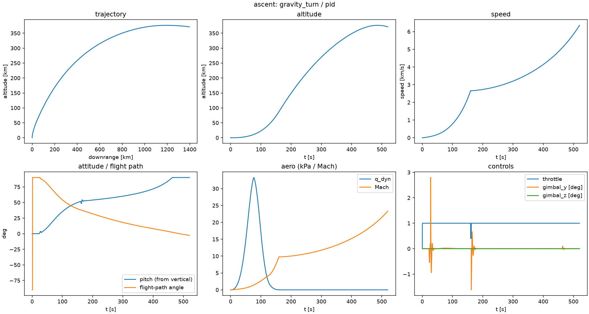

### 11.2 Nominal landing (dispersed + sensed)

`optimal` guidance + `mpc` controller + `ekf` nav, wind 8 m/s + 1.5 m/s gusts, GPS outage t∈[20,30] s:

| metric | optimal+mpc+ekf | zemzev+pid+ekf | zemzev+pid+perfect |
|---|---|---|---|
| touchdown $\|v_z\|$ [m/s] | **1.68** | 1.93 | 1.64 |
| lateral speed [m/s] | 0.53 | 1.10 | 1.12 |
| tilt [°] | 1.04 | 2.05 | 1.99 |
| lateral offset [m] | 1.98 | 2.19 | 1.99 |
| fuel used [kg] | 6637 | 6634 | 6644 |
| NLP fallbacks | 1 | — | — |

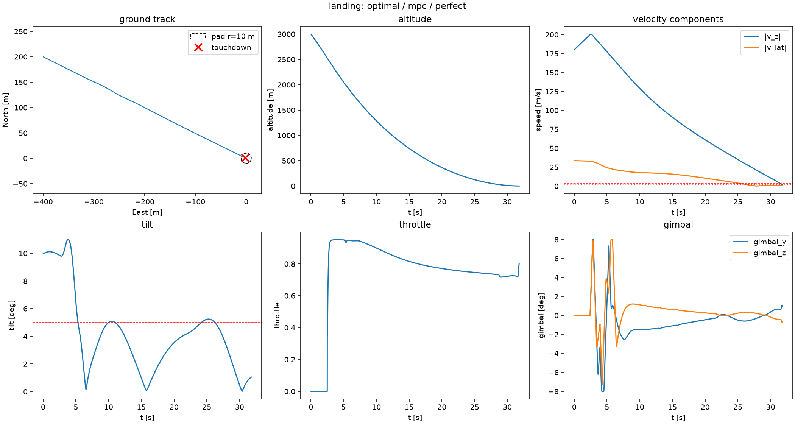
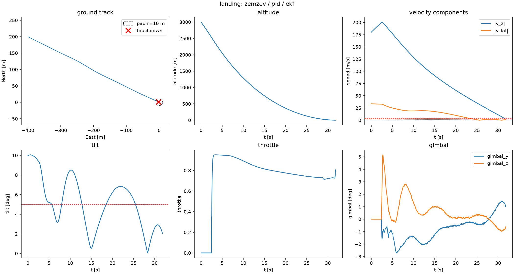
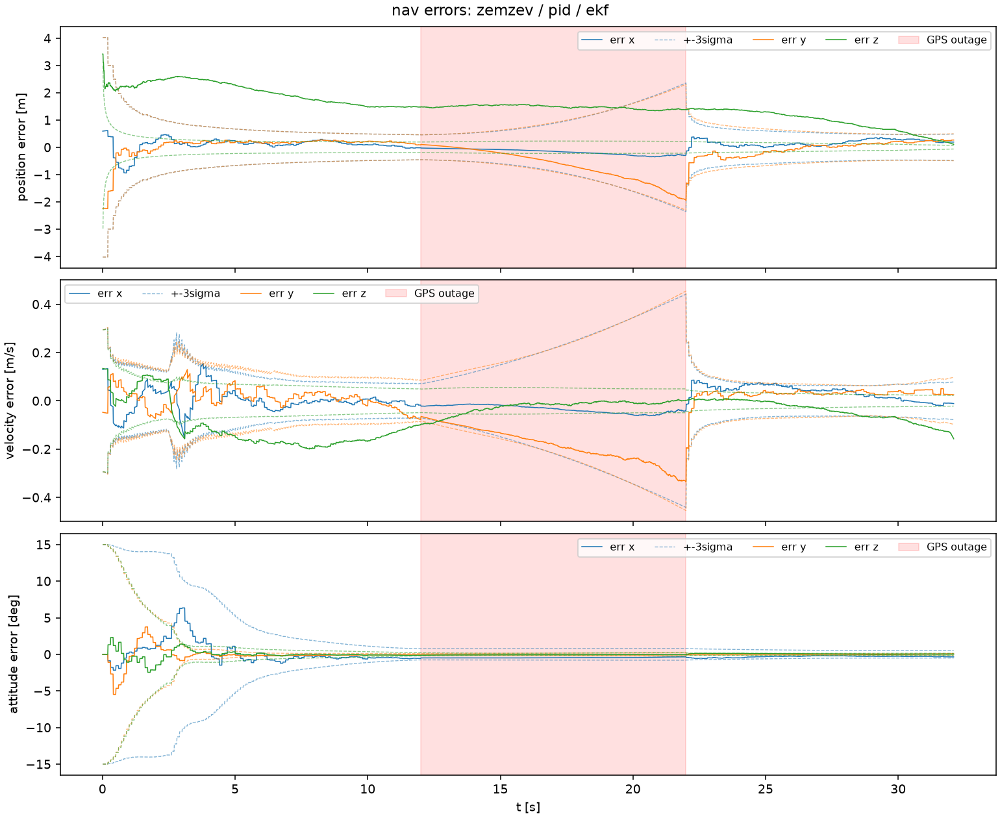

### 11.3 Controller comparison — n=20 dispersed seeds, optimal guidance + EKF

| controller | success | fuel [kg] | compute mean/p95 [ms] | dominant failure |
|---|---|---|---|---|
| PID | **5%** | 6644 | 2.0 / 14.5 | lateral_velocity (15/20) |
| LQR | **60%** | 6609 | 1.4 / 6.0 | lat_vel 4, hard 4 |
| Geometric | **25%** | 6355 | 1.3 / 4.3 | hard 8, lat_vel 7 |
| **MPC** | **65%** | 6583 | 7.6 / 20.6 | lat_vel 3, hard 3 |

Reading: all four land nominally; under dispersion + nav noise the gap opens — MPC's state-constrained lookahead (it *sees* the gimbal limit coming) and LQR's scheduled stability beat geometric feedback and PID. MPC's p95 compute of 20.6 ms is at the edge of the 20 ms control period — a real-time-feasibility flag worth noting.

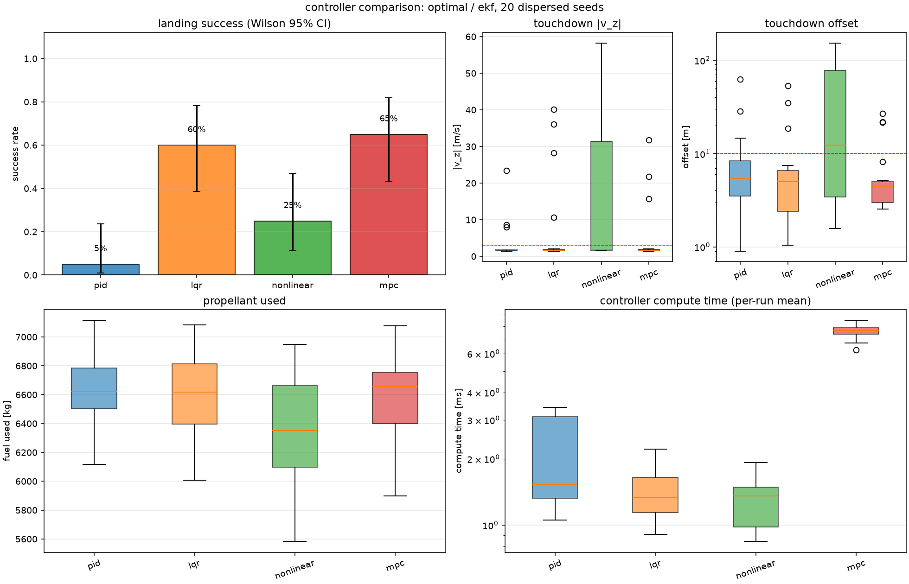
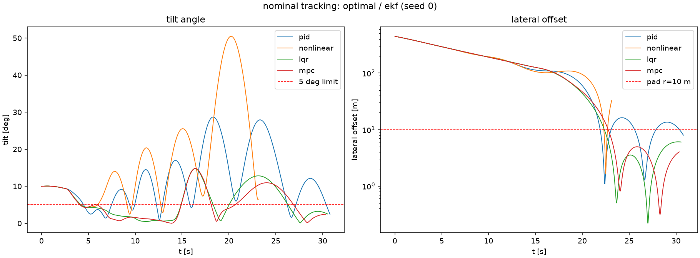

### 11.4 Guidance comparison — n=20 dispersed seeds, MPC + EKF

| guidance | success | fuel [kg] | mean compute [ms] |
|---|---|---|---|
| ZEM/ZEV | **90%** | 6688 | 6.7 |
| Polynomial | **90%** | 6687 | 14.0 |
| Optimal (SLSQP NLP) | **65%** | **6583** | 16.3 |

The honest, interesting result: the closed-form laws are *more robust* under dispersion (90%) while the fuel-optimal planner saves ~105 kg (−1.6%) but loses robustness — replan-solve failures fall back to ZEM/ZEV mid-flight, and the tighter feasible-set shape (tilt cone, thrust floor) is brittle exactly when dispersions push to the boundary. This is the classic optimality↔robustness trade and it's why production landers fly shaped closed-form laws with optimal trajectories as *targets*, not commands.

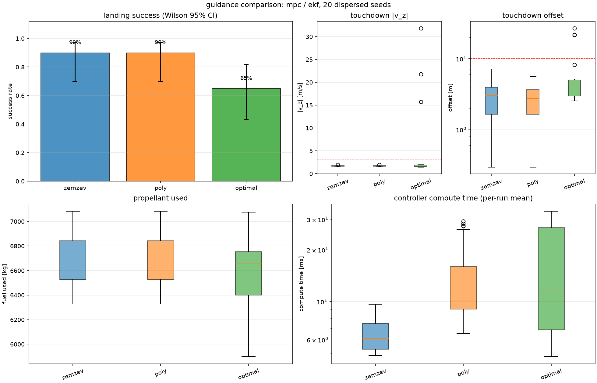
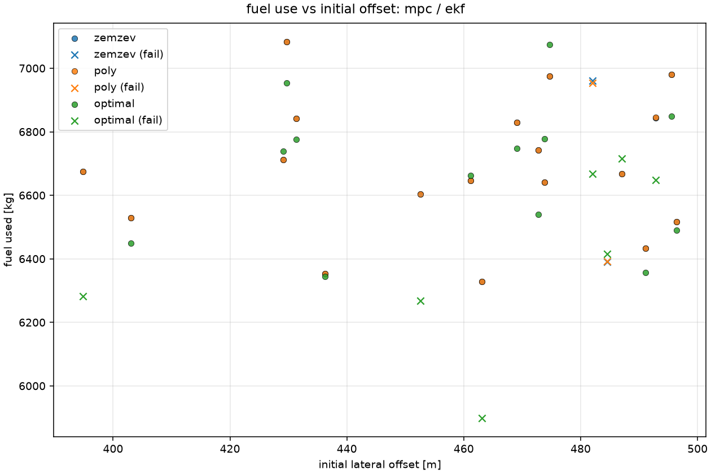

### 11.5 Monte Carlo — 100,000 dispersed landings (vectorized batch, seed 0)

| | rate / stat |
|---|---|
| **Success** | **42.95%** (42 945) |
| hard_landing | 40.52% |
| gps_outage_diverged | 12.20% |
| lateral_velocity | 2.44% |
| engine_failure | 1.51% |
| miss_pad | 0.30% |
| tipover | 0.06% |
| fuel_exhausted | 0.02% |
| TD $\|v_z\|$ p50/p95/p99 | 3.10 / 6.33 / 72.1 m/s |
| TD offset p50/p95 | 3.88 / 8.81 m |
| TD tilt p50/p95 | 1.61° / 3.35° |
| fuel remaining (successes) | mean 30.3%, p50 31.2% |
| wall time | 3238 s (32.4 ms/run) |

Benign ablation (20k, outages & engine failures disabled): **45.0%** — i.e. outages/failures cost only ~13.7 pp of failures; the residual failure mass is *physical* (hover-slam vertical-speed margin against wind/mass/thrust/density/IC dispersions), dominated by `hard_landing`. 87% of GPS-outage-windowed runs fail — the dead-reckoning drift rate is the most punishing dispersion modeled.

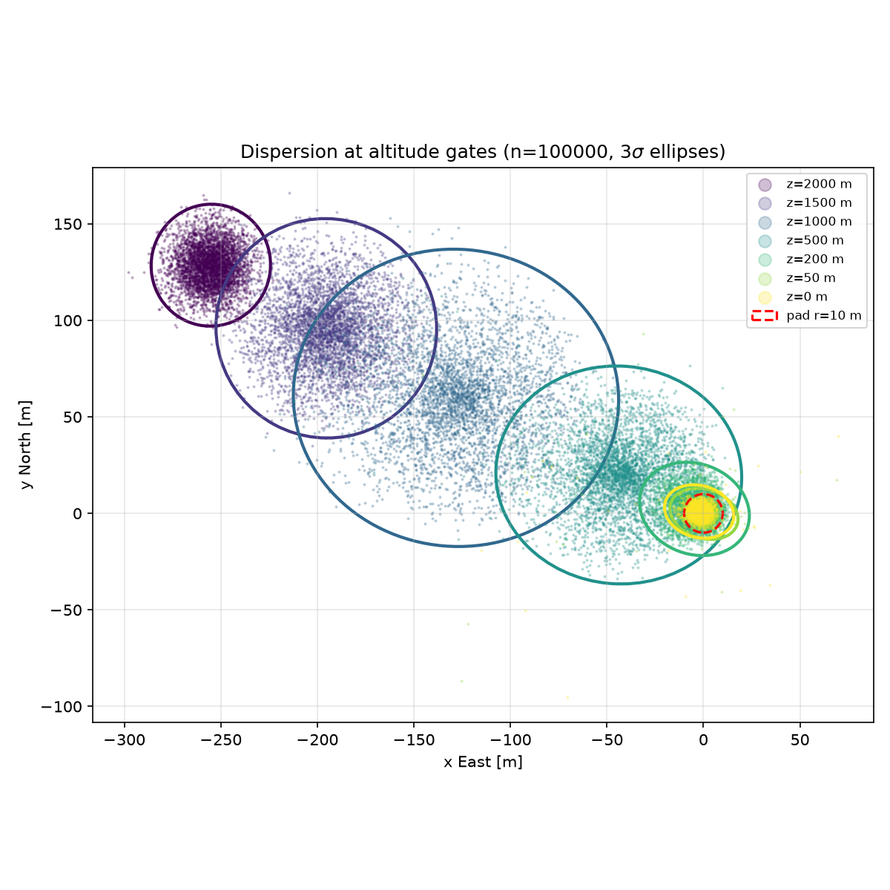
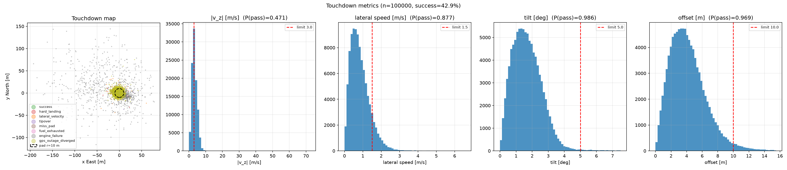
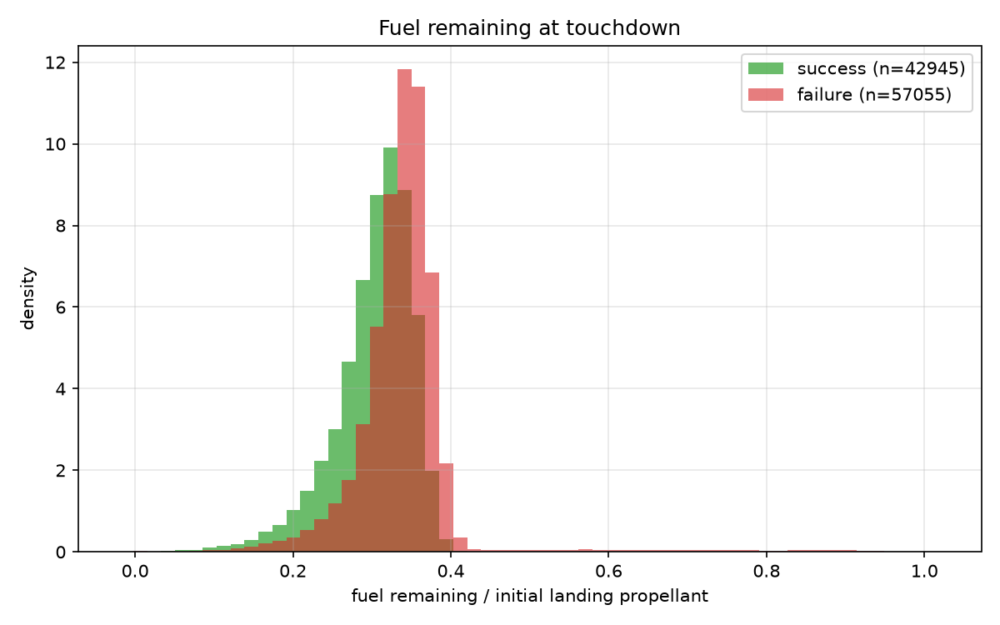
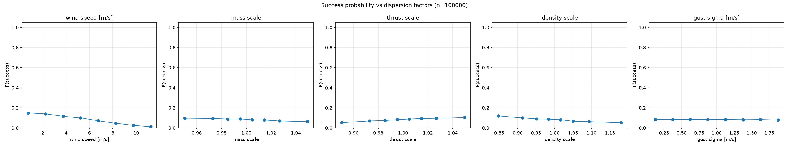
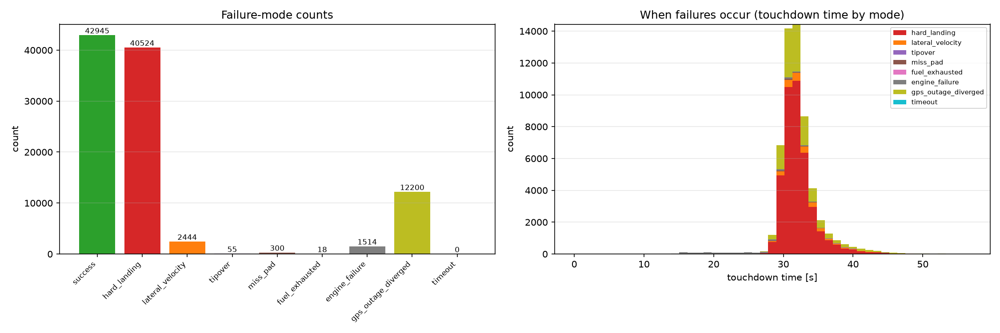

## 12. ML landing-success predictor

Task: *given the state at an altitude gate (1500/1000 m), predict P(landing success).* HistGradientBoosting + logistic-regression baseline, 70/15/15 stratified split, isotonic calibration on val, permutation importance; two feature sets — **observable** (what nav could actually report: gate state, mass proxy, $q_\infty$, energy, $t_{go}$, required-vs-available decel) and **oracle** (+ true dispersion draws).

| set @ gate | ROC-AUC | PR-AUC | Brier | base rate |
|---|---|---|---|---|
| observable 1500 m | 0.536 | 0.455 | 0.244 | 0.436 |
| oracle 1500 m | 0.575 | 0.491 | 0.241 | 0.436 |
| observable 1000 m | 0.544 | 0.463 | 0.244 | 0.436 |
| oracle 1000 m | **0.575** | **0.494** | 0.240 | 0.436 |

**Honest read**: skill is real but weak (PR-AUC ≈ +0.06 over base). The dominant failure mode — hover-slam hard landing — *develops* below the evaluated gates; at 1000–1500 m a run that will crash still looks mostly like a run that won't. Oracle features (true wind/thrust/mass) add ~4 pp ROC-AUC — the residual uncertainty is genuinely latent at those altitudes. This is exactly the regime where a predictor is useful for abort/decision logic rather than outcome forecasting, and it gives the honest negative-space result that gate-altitude state is *not* sufficient for confident success prediction — later gates or failure-mode-conditioned features are needed.

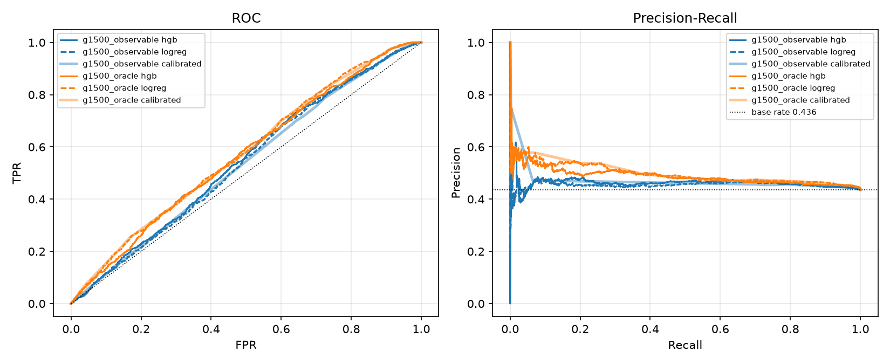
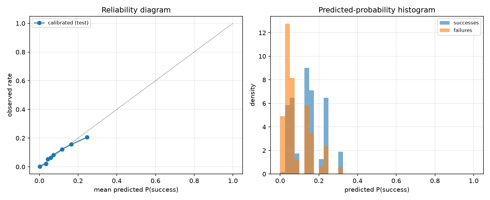
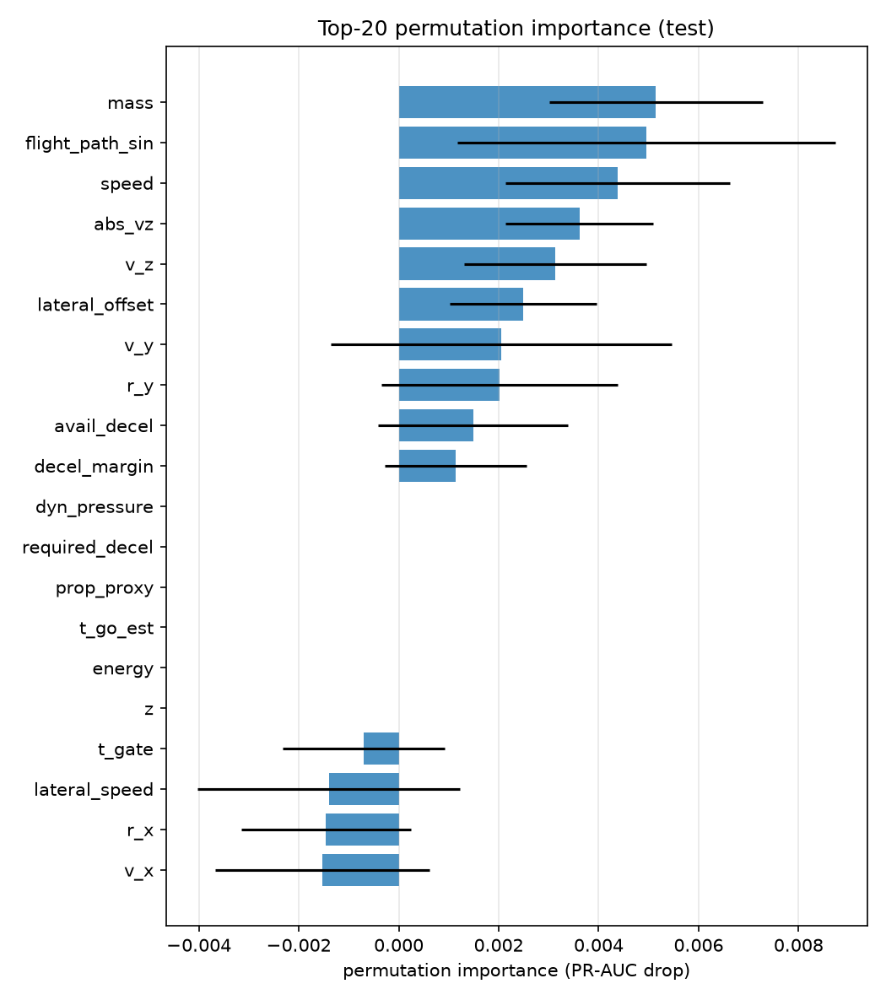
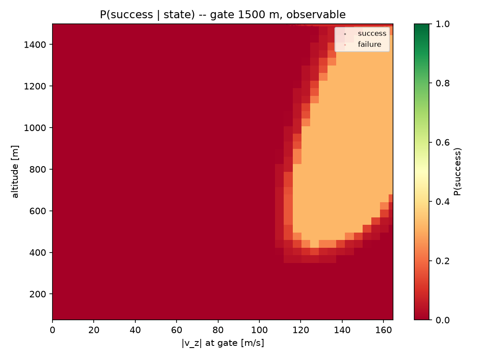

## 13. Policy search vs classical baseline

<!-- CEM RESULTS PENDING -->

## 14. Limitations & honesty notes

- Flat-Earth frame; no Earth rotation — fine at these durations/ranges, would matter for a real ascent.
- No propellant slosh, no structural flexibility, no plume-ground interaction, no landing-gear/contact dynamics (touchdown is a point event at $z=0$).
- Single-engine TVC ⇒ **no roll authority** under power (roll is aerodynamically/RCS damped); a real booster has ≥3 gimbaling engines or verniers.
- Batch-MC nav error is an OU/random-walk *approximation* of the EKF, not the EKF itself (that's what the scalar dispersed study covers).
- Engine "failure" is modeled as clean thrust loss — no asymmetric thrust, debris, or attitude transients.
- The SLSQP NLP is a point-mass fuel optimizer — it is *not* lossless-convexified SOCP (Acikmese-style); it occasionally fails to converge (hence the ZEM/ZEV fallback) and its constraint geometry is Euclidean, not conic.
- `alpha_max` during unpowered coast phases of the ascent log is a bookkeeping artifact of the AoA definition at ~zero dynamic pressure — noted so nobody cites it as tumble.

## 15. Repository layout & reproduction

```
sixdof/
  math/quaternion.py        scalar-first Hamilton quaternion toolkit
  environment/              US-76 atmosphere · gravity · wind (vectorized)
  vehicle.py                staging mass/CG/inertia model, engine, aero tables
  dynamics.py               rigid-body EOM, RK4/RK45, touchdown metrics
  sensors.py                IMU/GPS(latency,outage)/baro/radar-altimeter
  actuators.py              gimbal servo · throttle lag/delay · RCS · failures
  navigation/               MEKF (delayed-measurement, χ² gating) · UKF
  guidance/                 ascent gravity turn · ZEM/ZEV · polynomial · SLSQP NLP
  control/                  allocation · PID · LQR · geometric · MPC(FISTA QP)
  batch/                    vectorized 6-DOF Monte Carlo (100k-scale) + analysis
  ml/                       success-predictor features/training
  scenarios.py              landing/ascent scenario + dispersion + success criteria
  simulation.py             closed-loop harness, SimResult telemetry
scripts/                  run_ascent · run_landing · compare_* · run_monte_carlo
                          train_success_model · run_policy_search · make_arch_fig
tests/                    68 tests (physics, atmosphere, sensors, nav, guidance,
                          control, closed-loop landing, batch MC, ML)
docs/figures/             all figures referenced here
results/                  JSON summaries (npz/pkl artifacts gitignored)
```

```bash
uv venv --python 3.12 && uv pip install -e '.[dev]'
pytest -q
python scripts/run_ascent.py
python scripts/run_landing.py --guidance optimal --controller mpc --nav ekf
python scripts/compare_controllers.py --sweep
python scripts/compare_guidance.py --sweep
python scripts/run_monte_carlo.py --n 100000 --chunks 4
python scripts/train_success_model.py --npz results/monte_carlo_ml.npz --feature-set both
```

## 16. References

1. Açikmeşe & Ploen, "Convex Programming Approach to Powered Descent Guidance for Mars Landing," *JGCD* 30(5), 2007. (Motivation for the NLP formulation; this work uses SLSQP rather than SOCP.)
2. Etkin, *Dynamics of Atmospheric Flight* — 6-DOF rigid-body conventions.
3. U.S. Standard Atmosphere, 1976 (NOAA/NASA/USAF).
4. Crassidis & Junkins, *Optimal Estimation of Dynamic Systems* — MEKF/USQUE.
5. Guelman, "Guidance for asteroid rendezvous"/ZEM-ZEV terminal guidance lineage; Apollo E-guidance (Cherry) for the polynomial law.
6. Klumpp, "Apollo Lunar Descent Guidance," *Automatica* 10, 1974.
7. Dryden wind-gust models, MIL-F-8785C lineage for the GM turbulence.
8. Blackmore, "Autonomous Precision Landing of Space Rockets," *Bridge* 46(4), 2016.
